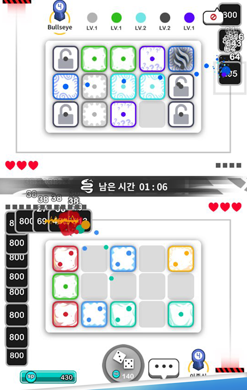

# Shape Tower Defense

## 목차
### 1) [컨셉](#컨셉)
### 2) [관련 자료](#관련-자료)
### 3) [구성 요소](#구성-요소)
### 4) [시스템 디자인](#시스템-디자인)
### 5) [개발 요구사항](#개발-요구사항)
 

## 컨셉
### 메인 컨셉
- 디펜스 (타워 디펜스)
### 서브 컨셉 : 도형
- 각이 점점 늘어날수록 강해지는 타워들 / 적 컨셉(미정)

 

## 관련 자료
- 랜덤 다이스 상점
 
 

 

- 랜덤 다이스 플레이 화면
 

 

## 구성 요소
### 매커니즘
- 정해진 타일에 타워를 설치해 적들을 없애며 최대한 오래 라운드를 버텨 클리어 하는것이 목표
- 적이 정해진 루트를 정해진 횟수만큼 돌면 라이프 차감
- 정해진 라이프가 전부 소진 될 경우 게임 오버
 

### 재미 요소
- 한정된 타일 갯수와 종류별 타워로 전략적 재미를 느낄 수 있음
- 라운드마다 바뀌는 새로운 루트
 

## 시스템 디자인
 

## 게임에서 사용될 공식

### 데미지 공식
- 속성 저항력과 데미지, 속도 등의 공식
### UI
- 라운드, 재화, 체력, 타일
### 씬 관리 및 옵션
- 사운드, 클릭, 종료 등
## 개발 요구사항
